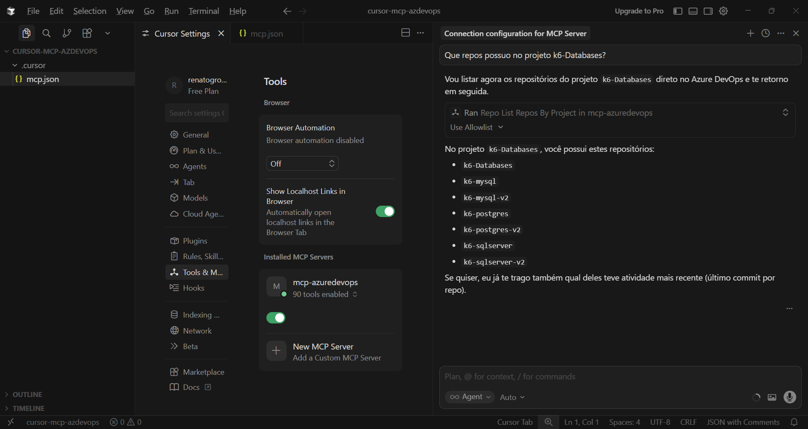

# azuredevops-mcp-cursor
Configurações para uso do MCP Server do Azure DevOps com Cursor.

Arquivo **mcp.json** (diretório **.cursor**):

```json
{
  "mcpServers": {
    "mcp-azuredevops": {
      "command": "npx",
      "args": ["-y", "@azure-devops/mcp", "organization-name"],
      "env": {
        "AZURE_DEVOPS_PAT": "PAT_AZDEVOPS"
      }
    }
  }
}
```

Exemplo de consutla aos repositórios de um projeto:

